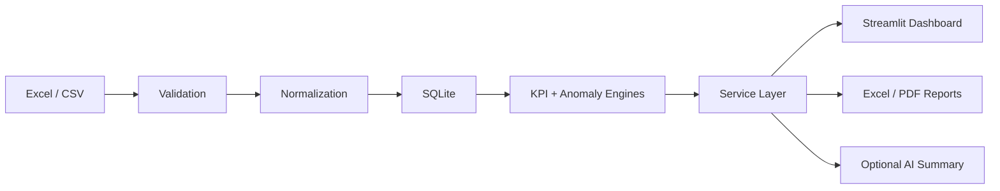

# Business Data Automation & KPI Dashboard

## Manufacturing Operations Case Study

**Portfolio Case Study / Synthetic Data Demonstration**

Turn disconnected production, quality, and inventory spreadsheets into validated operational intelligence, deterministic KPIs, visible exceptions, interactive dashboards, and repeatable management reports.

This released v1.0.0 portfolio MVP demonstrates transferable Python, Excel/CSV, data-quality, analytics, dashboard, and reporting automation skills. It is a local case study—not a production MES, customer deployment, or hosted multi-user product.

[Portfolio case study](docs/portfolio/PORTFOLIO_RELEASE_PACKAGE.md) · [Architecture](ARCHITECTURE.md) · [KPI definitions](docs/data/KPI_DEFINITIONS.md) · [Release evidence](docs/release/RELEASE_CHECKLIST.md) · [中文说明](README.zh-CN.md)

## Project overview

Manufacturing Operations Intelligence accepts four related operational datasets, checks their structure and content, normalizes valid records, persists one active batch in SQLite, and calculates documented KPIs and configurable anomalies. Five Streamlit areas help a manager explore the results. Excel/PDF reports and an optional management summary reuse the same structured analytics output.

## Business problem

Operations teams often maintain production plans, actual output, quality, and inventory in separate spreadsheets. Manual consolidation is slow, invalid records are easy to miss, and KPI definitions can drift between reports. Managers need a consistent way to identify what happened, where attention is required, and which source limitations affect the conclusions.

## Solution

- Validate Excel/CSV schemas, data types, required values, duplicates, ranges, and cross-dataset relationships.
- Preserve observable validation issues by dataset, row, field, reason, and severity.
- Normalize and store accepted records through a repository boundary.
- Calculate KPIs and rule-based anomalies with deterministic Python logic.
- Explore results through focused Overview, Production, Quality, Inventory, and Reports & Insights areas.
- Generate Excel and PDF management reports from already-calculated results.
- Provide an offline summary, with optional constrained AI phrasing when explicitly configured.

## Demo

There is no hosted demo yet. The repository is prepared for a read-only synthetic-data deployment on Streamlit Community Cloud; follow the [deployment guide](docs/deployment/STREAMLIT_COMMUNITY_CLOUD.md) to create and validate the public URL. Run the release locally, select **Load synthetic demo data**, and follow this three-to-five-minute path:

1. Review headline KPIs and alerts on **Overview**.
2. Filter **Production** to LINE-02 from 2025-01-26 through 2025-02-01 to inspect the controlled underperformance case.
3. Filter **Quality** to LINE-01 from 2025-02-27 through 2025-03-03 to inspect the seeded scrap-rate increase.
4. Open **Inventory** near 2025-03-18 to review materials below safety stock.
5. Open **Reports & Insights**, generate the offline management summary, and prepare Excel/PDF downloads.

The [portfolio release package](docs/portfolio/PORTFOLIO_RELEASE_PACKAGE.md) contains exact screenshot states, captions, and a 60-second video script.

## Screenshots

Release screenshots have not yet been published. The capture plan defines five reproducible views:

1. Executive Operations Overview
2. Production Plan vs Actual
3. Quality Yield and Scrap Trend
4. Inventory Risk by Material
5. Automated Reports and Management Insights

This section will become the image gallery after those assets are captured from v1.0.0. No placeholder is presented as a finished screenshot.

## Core features

- Excel workbook and four-file CSV ingestion
- Production plan, production actual, quality, and inventory domains
- Structured validation reporting and guarded active-batch replacement
- SQLite persistence behind repository interfaces
- Eight documented manufacturing KPIs, including explicit unavailable states when evidence is insufficient
- Configurable production, quality, downtime, variance, and inventory anomaly rules
- Plotly analytics with date, line, shift, product, and applicable material filters
- Structured Excel workbook and management PDF generation
- Deterministic offline management summary and optional AI draft
- Deterministic 90-day synthetic dataset with controlled abnormal scenarios

## Architecture

```text
UI: Streamlit pages
        ↓
Application / service layer
        ↓
Domain analytics: KPI and anomaly engines
        ↓
Data / repository layer: validation, normalization, SQLite
```

Streamlit pages do not calculate KPIs. Analytics code has no Streamlit dependency. Reports consume validated analytics results instead of recalculating metrics, and AI receives structured calculated facts. See [ARCHITECTURE.md](ARCHITECTURE.md) and the [architecture decisions](docs/decisions/).

## Data flow



## KPI definitions

The deterministic engine implements Production Attainment, Good Yield, Scrap Rate, Total Downtime, Completed Orders, Schedule Adherence, Inventory Risk, and Output by Production Line according to [KPI_DEFINITIONS.md](docs/data/KPI_DEFINITIONS.md). Some lifecycle metrics intentionally return unavailable when the source data cannot support them; AI does not fill those gaps.

The [Data Contract](docs/data/DATA_CONTRACT.md) owns canonical schemas and normalization rules. The [Anomaly Rules](docs/data/ANOMALY_RULES.md) own current thresholds and boundary behavior.

## Project structure

```text
streamlit_app.py                         Streamlit entry point
src/manufacturing_operations_intelligence/
  ui/                                    Streamlit composition
  services/                              Application workflows
  analytics/                             KPI and anomaly logic
  data/                                  Readers, validation, normalization, repositories
  reporting/                             Excel/PDF report preparation and rendering
  summaries/                             Offline and optional AI management summaries
data/samples/clean/                      Versioned synthetic demonstration CSV files
tests/                                   Unit, integration, reporting, and release tests
docs/                                    Product, data, design, quality, decision, release, and portfolio docs
```

## Technology stack

| Concern | Technology |
| --- | --- |
| Application and analytics | Python 3.12, Pandas |
| Dashboard and charts | Streamlit, Plotly |
| Persistence | SQLite |
| Spreadsheet reports | OpenPyXL |
| PDF reports | ReportLab |
| Quality | pytest, Ruff |
| Version control | Git, tagged v1.0.0 release |

## Quick start

### One-click launch on macOS

Double-click [start.command](start.command) in Finder. On first run it creates `.venv`, installs missing dependencies, opens `http://127.0.0.1:8501`, and starts the app. Keep the Terminal window open; press Control-C there to stop. If macOS blocks the first launch, right-click the file, choose **Open**, and confirm.

Set `MOI_PORT` if port 8501 is unavailable. Set `MOI_OPEN_BROWSER=false` to suppress automatic browser opening.

### Manual launch

```sh
python3.12 -m venv .venv
.venv/bin/python -m pip install --upgrade pip
.venv/bin/python -m pip install -e '.[dev]'
.venv/bin/streamlit run streamlit_app.py --server.address=127.0.0.1
```

The default database is `var/manufacturing_operations_intelligence.db`. The app reads process environment variables and does not load `.env` automatically. [.env.example](.env.example) lists supported settings without credentials. Keep the demo bound to loopback; it has no user authentication.

CSV intake requires one file for each `production_plan`, `production_actual`, `quality`, and `inventory`. Excel intake requires one `.xlsx` workbook with exactly those four worksheet names. Upload limits and accepted transformations are documented in the [Data Contract](docs/data/DATA_CONTRACT.md).

## Testing

The v1.0.0 release records 140 passing automated tests and a clean Ruff check. Reproduce the engineering validation with:

```sh
.venv/bin/ruff check .
.venv/bin/pytest -v
```

Tests cover business-critical validation, canonical normalization, persistence, exact KPI fixtures, anomaly boundaries, application-service integration, report generation, AI fallback behavior, and release smoke scenarios. See the [Test Plan](docs/quality/TEST_PLAN.md), [Security Review](docs/quality/SECURITY_REVIEW.md), and [Release Checklist](docs/release/RELEASE_CHECKLIST.md).

## AI design boundary

The core application works without an API key. The offline summary is deterministic. When optional AI is enabled, the model receives structured KPIs, anomalies, trends, scope, and limitations; it does not calculate KPIs, change source data, set anomaly thresholds, write to SQLite, or determine engineering or regulatory compliance. API failures fall back safely to the offline summary.

To enable the OpenAI Responses adapter, set `MOI_AI_ENABLED=true`, `MOI_AI_API_KEY` in the process environment, and optionally `MOI_AI_MODEL`. Never store a real key in project files or uploads.

## Limitations

- Local, single-user portfolio MVP using synthetic data only
- No authentication, multi-tenancy, public hosting, or real-time integrations
- Batch spreadsheet ingestion rather than MES, ERP, OPC-UA, IoT, or machine control
- No production-scale performance claim or regulatory/compliance use
- Product-owner decisions BA-01–BA-08, formal UAT artifacts, and an approved performance target remain recorded release exceptions
- KPI assumptions must be confirmed before adapting the project to a real company

## Roadmap

Feature development is frozen for v1.0.0. The immediate portfolio work is to capture release screenshots, export the architecture graphic, record the one-minute walkthrough, publish a reviewed GitHub repository/release, and optionally deploy a sanitized demo. Any future product changes require a new approved scope and must preserve the documented business-rule boundaries.

## License and usage note

No separate open-source license is currently included. Repository visibility alone does not grant reuse rights. This project is intended for portfolio review and synthetic-data demonstration; do not use it for production control, compliance decisions, or confidential customer data.
