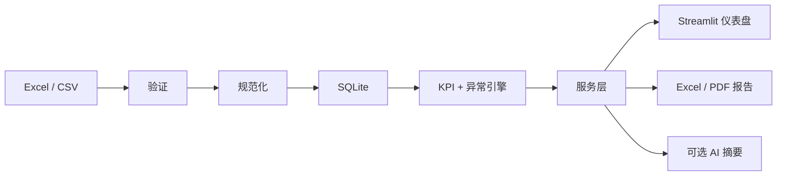

# 业务数据自动化与 KPI 仪表盘

## 制造运营案例研究

**作品集案例 / 合成数据演示**

将分散的生产、质量和库存电子表格转化为经过验证的运营信息、确定性 KPI、可见异常、交互式仪表盘和可重复的管理报告。

本项目是已发布的 v1.0.0 作品集 MVP，展示可迁移的 Python、Excel/CSV、数据质量、分析、仪表盘和报告自动化能力。它是公开的合成数据演示，不是生产 MES、客户部署或托管式多用户产品。

[作品集案例](docs/portfolio/PORTFOLIO_RELEASE_PACKAGE.zh-CN.md) · [架构](ARCHITECTURE.zh-CN.md) · [KPI 定义](docs/data/KPI_DEFINITIONS.zh-CN.md) · [发布证据](docs/release/RELEASE_CHECKLIST.zh-CN.md) · [English](README.md)

## 项目概览

Manufacturing Operations Intelligence 接收四个相关的运营数据集，检查结构与内容，规范化有效记录，将一个活动批次持久化到 SQLite，并计算已记录的 KPI 与可配置异常。五个 Streamlit 区域帮助管理者探索结果。Excel/PDF 报告和可选管理摘要复用同一份结构化分析输出。

## 业务问题

运营团队经常分别用电子表格维护生产计划、实际产出、质量和库存。手工汇总速度慢，无效记录容易被忽略，不同报告的 KPI 口径也可能漂移。管理者需要一致地了解发生了什么、哪里需要关注，以及哪些源数据限制会影响结论。

## 解决方案

- 验证 Excel/CSV 模式、数据类型、必填值、重复项、范围和跨数据集关系。
- 按数据集、行、字段、原因和严重度保留可观察的验证问题。
- 通过存储库边界规范化并保存通过验证的记录。
- 使用确定性 Python 逻辑计算 KPI 和规则异常。
- 通过 Overview、Production、Quality、Inventory、Reports & Insights 五个区域探索结果。
- 从已计算结果生成 Excel 与 PDF 管理报告。
- 提供离线摘要，并在显式配置时支持受约束的 AI 表达。

## 演示

请试用只读合成数据[公开演示](https://manufacturing-operations-intelligence-3pvpwneerbbz2xbx5hgaqw.streamlit.app/)。它运行于 Streamlit Community Cloud，不需要 AI API Key；上传已禁用，确定性的离线管理摘要仍可使用。[部署指南](docs/deployment/STREAMLIT_COMMUNITY_CLOUD.zh-CN.md)说明了配置和托管限制。也可以在本地运行发布版，选择 **Load synthetic demo data**，然后按照三至五分钟流程操作：

1. 在 **Overview** 查看核心 KPI 和异常。
2. 将 **Production** 筛选为 LINE-02、2025-01-26 至 2025-02-01，检查受控的低绩效场景。
3. 将 **Quality** 筛选为 LINE-01、2025-02-27 至 2025-03-03，检查预置的废品率上升场景。
4. 在 2025-03-18 附近打开 **Inventory**，查看低于安全库存的物料。
5. 打开 **Reports & Insights**，生成离线管理摘要，并准备 Excel/PDF 下载。

[作品集发布包](docs/portfolio/PORTFOLIO_RELEASE_PACKAGE.zh-CN.md)包含精确截图状态、图注和 60 秒视频脚本。

## 截图

发布版截图尚未发布。最终采集包定义了四个可复现资产：

1. Executive Operations Overview
2. Production Plan vs Actual
3. Quality Monitoring & Inventory Risk
4. Automated Reports and Management Insights

第三个资产是 Quality 与 Inventory 的双画面组合。精确筛选、可复现 KPI 数值、图注、封面规范和视频脚本见[最终作品集发布包](docs/portfolio/PORTFOLIO_RELEASE_PACKAGE.zh-CN.md)。完成 v1.0.0 资产采集后，此处将成为图片展示区。

## 核心功能

- Excel 工作簿和四文件 CSV 导入
- 生产计划、生产实绩、质量和库存四个领域
- 结构化验证报告和受保护的活动批次替换
- 通过存储库接口隔离的 SQLite 持久化
- 八个已记录的制造 KPI；证据不足时显式返回不可用状态
- 可配置的生产、质量、停机、偏差和库存异常规则
- 带日期、产线、班次、产品和适用物料筛选的 Plotly 分析
- 结构化 Excel 工作簿和管理 PDF 生成
- 确定性离线管理摘要和可选 AI 草稿
- 包含受控异常场景的确定性 90 天合成数据集

## 架构

```text
UI：Streamlit 页面
        ↓
应用 / 服务层
        ↓
领域分析：KPI 与异常引擎
        ↓
数据 / 存储层：验证、规范化、SQLite
```

Streamlit 页面不计算 KPI；分析代码不依赖 Streamlit；报告消费已验证分析结果，不重新计算指标；AI 接收结构化的已计算事实。参见 [ARCHITECTURE.zh-CN.md](ARCHITECTURE.zh-CN.md)和[架构决策](docs/decisions/)。

## 数据流



## KPI 定义

确定性引擎依据 [KPI_DEFINITIONS.zh-CN.md](docs/data/KPI_DEFINITIONS.zh-CN.md)实现生产达成率、良品率、废品率、总停机时间、完工订单、计划遵守率、库存风险和产线产出。源数据无法支持部分生命周期指标时，这些指标会返回不可用；AI 不会填补证据缺口。

[数据契约](docs/data/DATA_CONTRACT.zh-CN.md)定义规范模式和规范化规则；[异常规则](docs/data/ANOMALY_RULES.zh-CN.md)定义当前阈值与边界行为。

## 项目结构

```text
streamlit_app.py                         Streamlit 入口
src/manufacturing_operations_intelligence/
  ui/                                    Streamlit 组合
  services/                              应用工作流
  analytics/                             KPI 与异常逻辑
  data/                                  读取、验证、规范化、存储库
  reporting/                             Excel/PDF 报告准备与渲染
  summaries/                             离线及可选 AI 管理摘要
data/samples/clean/                      纳入版本控制的合成演示 CSV
tests/                                   单元、集成、报告与发布测试
docs/                                    产品、数据、设计、质量、决策、发布和作品集文档
```

## 技术栈

| 关注点 | 技术 |
| --- | --- |
| 应用与分析 | Python 3.12、Pandas |
| 仪表盘与图表 | Streamlit、Plotly |
| 持久化 | SQLite |
| 电子表格报告 | OpenPyXL |
| PDF 报告 | ReportLab |
| 质量 | pytest、Ruff |
| 版本控制 | Git、带标签的 v1.0.0 发布 |

## 快速开始

### macOS 一键启动

在 Finder 中双击 [start.command](start.command)。首次运行时，它会创建 `.venv`、安装缺失依赖、打开 `http://127.0.0.1:8501` 并启动应用。使用期间保持 Terminal 窗口打开；在其中按 Control-C 停止。如果 macOS 阻止首次启动，请右键该文件，选择**打开**并确认。

8501 端口不可用时设置 `MOI_PORT`。设置 `MOI_OPEN_BROWSER=false` 可禁止自动打开浏览器。

### 手动启动

```sh
python3.12 -m venv .venv
.venv/bin/python -m pip install --upgrade pip
.venv/bin/python -m pip install -e '.[dev]'
.venv/bin/streamlit run streamlit_app.py --server.address=127.0.0.1
```

默认数据库是 `var/manufacturing_operations_intelligence.db`。应用读取进程环境变量，不自动加载 `.env`。[.env.example](.env.example)列出不含凭据的支持配置。本地演示没有用户认证，应始终仅监听回环地址。

CSV 输入要求分别提供 `production_plan`、`production_actual`、`quality` 和 `inventory` 四个文件。Excel 输入要求一个 `.xlsx` 工作簿，恰有上述四个同名工作表。上传限制和允许的转换见[数据契约](docs/data/DATA_CONTRACT.zh-CN.md)。

## 测试

当前发布验证记录为 141 项自动化测试通过且 Ruff 检查通过。使用以下命令复现工程验证：

```sh
.venv/bin/ruff check .
.venv/bin/pytest -v
```

测试覆盖业务关键的数据验证、规范化、持久化、精确 KPI 固定数据、异常边界、应用服务集成、报告生成、AI 回退和发布冒烟场景。参见[测试计划](docs/quality/TEST_PLAN.zh-CN.md)、[安全审查](docs/quality/SECURITY_REVIEW.zh-CN.md)和[发布检查表](docs/release/RELEASE_CHECKLIST.zh-CN.md)。

## AI 设计边界

核心应用无需 API 密钥即可工作。离线摘要是确定性的。启用可选 AI 后，模型接收结构化 KPI、异常、趋势、范围和限制；它不计算 KPI、不修改源数据、不设置异常阈值、不写入 SQLite，也不判断工程或法规合规性。API 失败时安全回退到离线摘要。

要启用 OpenAI Responses 适配器，请在进程环境中设置 `MOI_AI_ENABLED=true`、`MOI_AI_API_KEY`，并可选设置 `MOI_AI_MODEL`。不得把真实密钥存入项目文件或上传数据。

## 限制

- 仅使用合成数据的单用户作品集 MVP
- 没有身份验证、多租户、实时集成或生产级托管保证
- 批量电子表格导入，不是 MES、ERP、OPC-UA、IoT 或设备控制
- 不宣称生产规模性能，也不用于法规/合规判断
- BA-01–BA-08 产品负责人决策、正式 UAT 产物和已批准性能目标仍是已记录的发布例外
- 将项目适配到真实公司前，必须确认 KPI 假设

## 路线图

v1.0.0 已冻结功能。当前作品集工作的重点是采集发布版截图、导出架构图和录制一分钟演示。经过审核的 GitHub 仓库和脱敏的公开演示现已上线。未来产品变更必须经过新的范围批准，并继续遵守已记录的业务规则边界。

## 许可与使用说明

仓库目前没有单独的开源许可证。仓库可见不代表自动授予复用权。本项目用于作品集审阅与合成数据演示；不得用于生产控制、合规决策或客户机密数据。
