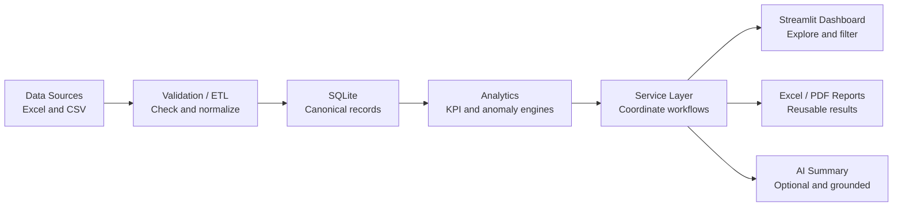

# Portfolio Release Package

**Business Data Automation & KPI Dashboard**

*Manufacturing Operations Case Study*

> Portfolio Case Study / Synthetic Data Demonstration. This project uses generated manufacturing data and does not represent a customer deployment or measured commercial outcome.

Chinese companion: [PORTFOLIO_RELEASE_PACKAGE.zh-CN.md](PORTFOLIO_RELEASE_PACKAGE.zh-CN.md)

## Final positioning

This portfolio project shows how disconnected operational spreadsheets can become a validated, repeatable management workflow. Its manufacturing scenario demonstrates transferable delivery skills in multi-source data ingestion, data-quality controls, deterministic KPI calculation, rule-based anomaly detection, interactive dashboards, automated reports, and optional AI-assisted communication.

**Primary audience:** Upwork clients, small and medium businesses, manufacturing operations teams, and buyers of data, dashboard, Excel, Python, and reporting automation.

## Business case study

### Problem

Manufacturing teams often manage production plans, actual output, quality, and inventory in disconnected spreadsheets. Different formats and missing or invalid values make consolidation slow, while manually rebuilt metrics can be inconsistent. Managers need a clear view of performance and exceptions without inspecting every row.

### Solution

The application accepts Excel or CSV operational data, validates each dataset, normalizes accepted records, and stores a consistent local dataset. A deterministic analytics engine calculates documented KPIs and rule-based anomalies. A Streamlit dashboard presents the results, while Excel and PDF exports reuse those calculated results. An optional AI layer can turn structured facts into management language; a deterministic offline summary remains available without an API key.

### Workflow

```text
Spreadsheet files
  -> validation and visible issue reporting
  -> normalization
  -> SQLite persistence
  -> KPI and anomaly engines
  -> application services
  -> dashboard, Excel/PDF reports, and optional AI summary
```

### Key capabilities

- Processes four related operational domains: production plan, production actual, quality, and inventory.
- Reports schema, type, required-field, duplicate, relationship, and value errors without silently discarding invalid rows.
- Calculates production attainment, good yield, scrap rate, downtime, completed orders, schedule adherence, inventory risk, and output by line.
- Detects configurable production, quality, downtime, variance, and inventory exceptions with severity and context.
- Provides Overview, Production, Quality, Inventory, and Reports & Insights views with date, line, shift, product, and material filters where applicable.
- Generates structured Excel and management-ready PDF reports from the same validated analytics results shown in the application.
- Produces an offline management summary and supports an optional, constrained AI draft.

### Architecture

The design separates interface work from business rules. Streamlit calls application services; services coordinate repositories, analytics, anomaly rules, reporting, and summaries. KPI functions do not depend on Streamlit, reports do not recalculate metrics, and the AI component receives structured calculated facts.

[Read the full architecture](../../ARCHITECTURE.md) · [Read the architecture decisions](../decisions/)

### Business value

- Replaces repeated spreadsheet consolidation with a reproducible workflow.
- Makes invalid data and data-quality limitations visible before management reporting.
- Gives operations managers one view of output, quality, downtime, order progress, and stock risk.
- Produces repeatable management packs without copying figures between dashboard and report logic.
- Demonstrates an approach that can be adapted to other operational data and reporting workflows.

These are demonstrated capabilities, not claims of measured customer ROI.

### Technology

Python, Streamlit, Pandas, Plotly, SQLite, OpenPyXL, ReportLab, pytest, and Ruff.

### Testing

The v1.0.0 release records 140 passing automated tests and a clean Ruff check. Coverage emphasizes data validation, canonical normalization, repository behavior, exact KPI fixtures, anomaly boundaries, service integration, reporting, AI fallback behavior, and release smoke checks. See the [test plan](../quality/TEST_PLAN.md) and [release checklist](../release/RELEASE_CHECKLIST.md).

### Limitations

- Local, single-user portfolio MVP; no authentication, multi-tenancy, hosted environment, or enterprise integrations.
- Uses synthetic demonstration data only.
- Batch spreadsheet workflow rather than live machine, MES, ERP, OPC-UA, or IoT ingestion.
- KPI semantics follow the documented portfolio assumptions and require confirmation before use in a real organization.
- AI text is optional, advisory, and subject to human review; deterministic calculations remain authoritative.
- No claim of customer deployment, commercial ROI, production-scale performance, or regulatory compliance.

## Screenshot capture plan

Capture at 1440 x 900 or a similar 16:10 desktop viewport. Use the bundled synthetic dataset, keep the browser zoom at 100%, and crop browser chrome consistently. Do not include API keys, local paths, terminal windows, or debug output.

| ID | Exact app state and filters | What should be visible | Screenshot title | Recommended Upwork caption |
| --- | --- | --- | --- | --- |
| 01 Executive Overview | Load the demo dataset. Open **Overview**. Date: **2025-01-01 to 2025-03-31**. Leave production line, shift, and product blank (all). Downtime threshold: **120 minutes**. | Six headline KPI cards, anomaly callout, production trend, and management-level scope context. | Executive Operations Overview | A single management view brings production, quality, downtime, completed orders, and inventory risk together from four validated datasets. |
| 02 Production Analysis | Open **Production**. Date: **2025-01-26 to 2025-02-01**. Line: **LINE-02**. Leave shift and product blank. | Plan versus actual trend, production attainment, total downtime, output by line, downtime by line, and relevant alerts for the controlled underperformance window. | Production Plan vs Actual | Date and production-line filters isolate a reproducible underperformance period and show the difference between planned and actual output. |
| 03 Quality Analysis | Open **Quality**. Date: **2025-02-27 to 2025-03-03**. Line: **LINE-01**. Leave shift and product blank. | Good yield, scrap rate, quality trend, and quality anomalies for the seeded scrap-rate increase. | Quality Yield and Scrap Trend | Deterministic quality metrics and exception rules highlight a controlled scrap-rate increase without relying on AI calculations. |
| 04 Inventory / Risk | Open **Inventory**. Date: **2025-03-12 to 2025-03-18**. Leave production filters blank. Select materials **MAT-005, MAT-012, MAT-027, MAT-038**. | Materials-below-safety-stock KPI, latest inventory versus safety stock, and the stock-observation chart. The anomaly detail table is captured in screenshot 05. | Inventory Risk by Material | Latest-snapshot inventory logic identifies materials below safety stock and gives managers a focused exception list. |
| 05 Reports / Insights | Open **Reports & Insights**. Date: **2025-01-01 to 2025-03-31**. Leave line, shift, and product blank. Threshold: **120 minutes**. Generate the management summary, then generate reports. | Scope summary, production trend, anomaly table, deterministic offline summary, and both Excel and PDF download actions. | Automated Reports and Management Insights | The same validated analytics results feed dashboard insights, Excel workbooks, PDF management reports, and an offline summary. |
| 06 Architecture (optional) | Export the diagram in this document on a white or transparent background at 1600 x 900. | One readable left-to-right flow with short labels and no code-level detail. | From Spreadsheet to Management Insight | A layered Python workflow validates operational files, calculates deterministic metrics, and publishes consistent dashboard and report outputs. |

Before publishing, check that every value shown is reproducible from the release dataset and that no cropped tooltip obscures a label.

## 45–60 second demo video script

| Time | Screen action | Exact narration | On-screen caption |
| --- | --- | --- | --- |
| 0–5 s | Show title card, then transition to the loaded app. | “Disconnected operations spreadsheets can make management reporting slow and inconsistent.” | Business Data Automation & KPI Dashboard |
| 5–15 s | Open Overview and move across the headline KPIs and production trend. | “This portfolio case study validates production, quality, and inventory data, then turns it into a clear executive overview.” | Validated operational intelligence |
| 15–25 s | Open Production; apply the LINE-02 and underperformance-window filters. | “Managers can compare plan versus actual output, isolate a line or date range, and review downtime and order progress.” | Production performance by scope |
| 25–35 s | Open Quality, then Inventory; show the seeded quality and stock-risk cases. | “Deterministic rules highlight scrap, production, downtime, and materials below safety stock, with the threshold and context preserved.” | Reproducible anomaly detection |
| 35–45 s | Open Reports & Insights and generate the Excel and PDF reports. | “The application creates structured Excel and PDF management reports from the same calculated results—without recalculating KPIs.” | Consistent automated reporting |
| 45–55 s | Generate the management summary in AI-disabled mode and reveal the limitations section. | “A factual offline summary works without an API key, while optional AI can help phrase and prioritize already calculated facts.” | AI optional · deterministic facts authoritative |
| 55–60 s | Show the architecture diagram and closing title. | “It is a compact example of reliable Python, spreadsheet, dashboard, and reporting automation.” | Portfolio Case Study · Synthetic Data |

## Upwork portfolio copy

### A. Portfolio title

**Business Data Automation & KPI Dashboard — Manufacturing Operations Case Study**

### B. Short description

I built a Python application that transforms production, quality, and inventory spreadsheets into validated KPIs, rule-based alerts, interactive dashboards, and automated Excel/PDF management reports. The project uses synthetic data and demonstrates an end-to-end business data automation workflow.

### C. Long description

Many operations teams collect critical information in separate Excel and CSV files. Before that data can support decisions, it must be checked, aligned, calculated consistently, and presented clearly.

For this portfolio case study, I designed and built a complete local workflow for four connected manufacturing datasets: production plans, production actuals, quality, and inventory. The application validates schemas and row values, reports errors visibly, normalizes accepted records, and persists a canonical dataset in SQLite.

A deterministic analytics layer calculates documented production, quality, downtime, order, and inventory KPIs. Configurable rules identify operational exceptions and explain the observed value, threshold, severity, entity, and time range. A Streamlit dashboard provides focused Overview, Production, Quality, Inventory, and Reports & Insights areas with practical filters.

Excel and PDF management reports consume the same analytics results as the dashboard. The application also provides a deterministic offline management summary. Optional AI can help summarize and prioritize those structured facts, but it never calculates authoritative KPIs or decides whether an anomaly exists.

This is a portfolio demonstration built with synthetic data. It shows how I approach spreadsheet automation, data quality, business rules, dashboards, reporting, testing, and clear handover documentation. It is not presented as a customer deployment or production MES.

### D. Skills / tags

Python, Excel Automation, Data Processing, Data Validation, Pandas, Streamlit, Plotly, SQLite, KPI Dashboard, Business Intelligence, Data Visualization, Automated Reporting, PDF Reports, Manufacturing Analytics, pytest

### E. Problem statement

Operational data spread across disconnected spreadsheets creates repeated manual work, inconsistent calculations, hidden data-quality issues, and slow management reporting.

### F. Solution statement

A layered Python workflow validates and normalizes related files, stores consistent records, calculates documented KPIs and exceptions, and publishes the results through an interactive dashboard and repeatable Excel/PDF reports.

### G. Deliverables

- Streamlit dashboard with five operational areas and filters
- Excel/CSV ingestion and observable validation reporting
- Canonical normalization and SQLite persistence
- Deterministic KPI and configurable anomaly engines
- Excel and PDF management report generation
- Offline management summary with optional constrained AI support
- Synthetic 90-day demonstration dataset
- Automated tests, architecture notes, data contract, KPI definitions, and release documentation

### H. Technology stack

Python, Streamlit, Pandas, Plotly, SQLite, OpenPyXL, ReportLab, pytest, Ruff, and Git.

### I. Role / responsibilities

Product scoping, data-contract design, architecture, Python implementation, validation and analytics logic, dashboard design, reporting, test automation, release hardening, technical documentation, and portfolio presentation.

### J. Data disclaimer

**Portfolio Case Study / Synthetic Data Demonstration.** All operational records are generated for demonstration. No customer data, deployment claim, commercial result, or measured ROI is represented.

## GitHub presentation recommendations

### Repository metadata

- **Suggested repository name:** `business-data-automation-kpi-dashboard`
- **Suggested description:** “Portfolio case study: validate operational spreadsheets, calculate deterministic KPIs and anomalies, and generate Streamlit dashboards plus Excel/PDF management reports.”
- **Suggested topics:** `python`, `streamlit`, `pandas`, `plotly`, `sqlite`, `excel-automation`, `data-validation`, `kpi-dashboard`, `business-intelligence`, `automated-reporting`, `manufacturing-analytics`, `portfolio-project`

### Repository page

- Keep the client-focused title, one-sentence value proposition, synthetic-data label, and screenshot strip above detailed setup instructions.
- Place three images immediately after the Demo section: Executive Overview, Production Analysis, and Reports & Insights. Link the remaining screenshots from a compact gallery.
- Link directly to [ARCHITECTURE.md](../../ARCHITECTURE.md), [KPI_DEFINITIONS.md](../data/KPI_DEFINITIONS.md), and this case study.
- Add a live-demo link only after a stable, sanitized deployment exists. Until then, label the demo as local and provide the one-command launcher.
- Use only verifiable badges. A release badge and supported Python version are useful; add test/CI badges only after public CI exists. Avoid decorative technology-count or “built with love” badges.
- Create a GitHub Release from the existing `v1.0.0` tag after the repository is published. Attach release notes; do not attach local databases or generated reports.

## Architecture diagram specification

**Purpose:** explain the delivery flow to a non-specialist client in under ten seconds.

**Format:** 1600 x 900, white or transparent background, horizontal flow, one accent color, dark readable labels, simple line icons, and no framework logos inside the main flow. Use nine equal nodes with short sublabels. Provide SVG for README use and PNG for Upwork/video use.



The portfolio headline may summarize the final outputs as “Dashboard → Reports → AI Summary,” but the rendered diagram should branch from the service layer. This matches the implementation: reports and AI consume structured results and do not depend on one another.

## Portfolio asset inventory

| Asset | Status | Evidence / next action |
| --- | --- | --- |
| GitHub repository | **MISSING** | A professional local Git history and `v1.0.0` tag exist, but no Git remote is configured. Create a public repository, review visibility, then push branch and tags. |
| Live demo | **MISSING** | The local app is reproducible; no hosted URL is documented. Publish only after choosing a hosting option and confirming synthetic data, resource limits, and AI-disabled behavior. |
| 3–5 screenshots | **MISSING** | The exact capture states and captions are defined above. Capture five release-version images and store optimized assets under `docs/portfolio/assets/screenshots/`. |
| Architecture diagram | **NEEDS WORK** | The diagram specification and Mermaid source are ready; export polished SVG and PNG assets. |
| 45–60 second demo video | **MISSING** | The 60-second script is ready; record after screenshots and final viewport checks. |
| Upwork portfolio description | **READY** | Copy is included above and clearly identifies synthetic data. |
| README | **READY** | Client-first English and Chinese versions are included in this presentation branch. |
| Sample dataset | **READY** | Four version-controlled synthetic CSV datasets cover 90 days and controlled abnormal scenarios. |
| v1.0.0 release | **READY** | Local annotated release tag and release documentation exist; publish the GitHub Release after a remote is created. |

## Publication sequence

1. Capture and review the five screenshots from the tagged release behavior.
2. Export the architecture diagram to SVG and PNG.
3. Record and caption the 60-second video.
4. Create the GitHub repository and push the reviewed history and tags.
5. Add screenshots and demo media, then publish the GitHub Release.
6. Publish a sanitized live demo if desired.
7. Add the final links and media to Upwork using the copy above.
