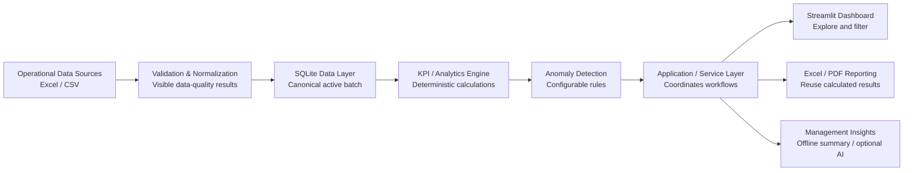

# Business Data Automation & KPI Dashboard

## Manufacturing Operations Case Study

**Final Portfolio Package · v1.0.0**

> **Portfolio Case Study / Synthetic Data Demonstration.** All manufacturing records are generated. This project does not represent a customer deployment, measured ROI, or a production MES.

- **Live demo:** [Streamlit public demo](https://manufacturing-operations-intelligence-3pvpwneerbbz2xbx5hgaqw.streamlit.app/)
- **Repository:** [GitHub](https://github.com/lan995173441/manufacturing-operations-intelligence)
- **Release baseline:** [`v1.0.0` tag](https://github.com/lan995173441/manufacturing-operations-intelligence/tree/v1.0.0)
- **Chinese companion:** [PORTFOLIO_RELEASE_PACKAGE.zh-CN.md](PORTFOLIO_RELEASE_PACKAGE.zh-CN.md)

## Positioning and case study

### Problem

Operations teams often manage production plans, actual output, quality, and inventory across disconnected spreadsheets. Manual consolidation is slow, invalid records are easy to overlook, and figures can drift between a dashboard and a management report.

### Solution

This portfolio project turns four related Excel/CSV domains into a validated analytics workflow: visible data-quality checks, normalization, SQLite persistence, deterministic KPI and anomaly calculations, a manager-friendly dashboard, Excel/PDF reports, and a deterministic management summary that works without an API key.

### Business value demonstrated

- A repeatable path from operational files to management-ready information.
- Data-quality issues that remain visible instead of silently disappearing.
- One calculated source for dashboard views, anomaly rules, Excel, and PDF reports.
- Lightweight internal-tool delivery using Python, spreadsheets, analytics, and reporting automation.

The manufacturing context makes the workflow concrete; the underlying delivery skills transfer to other operations, finance, supply-chain, and business-reporting workflows.

## 1. Screenshot Capture Package

Use the public demo in a clean browser session. Capture at **1440 × 900 px**, browser zoom **100%**, with browser chrome excluded. Use a 16:10 crop, no tooltips, no terminal windows, and no Streamlit owner controls. Keep the UI in English.

| ID | Exact page and filters | Synthetic state and KPI values to show | Required charts/tables | Title and Upwork caption |
| --- | --- | --- | --- | --- |
| **01** | **Overview**. Date: `2025-01-01`–`2025-03-31`; line, shift, product blank; downtime threshold `120`. | Production attainment **98.01%**; good yield **97.79%**; scrap rate **2.21%**; total downtime **12,661 line-minutes**; inventory risk **0 materials**; completed orders remains **N/A** with its evidence limitation. The controlled dataset returns **52** reviewable alerts at this threshold. | Six KPI cards, Alerts section, planned-versus-actual daily production trend. | **Executive Overview** — “Validated production, quality, inventory, and exception signals in one management view.” |
| **02** | **Production**. Date: `2025-01-26`–`2025-02-01`; line `LINE-02`; shift and product blank; downtime threshold `120`. | Controlled underperformance: attainment **73.52%**, total downtime **296 line-minutes**, LINE-02 output **11,909 ea**, and **28** production/variance alerts. | Planned-versus-actual trend, output by line, downtime by line, selected production detail, relevant alerts. | **Production Planning & Performance** — “Filters isolate a reproducible plan-versus-actual gap, downtime, and rule-based exceptions.” |
| **03** | **Composite of two matching captures**: left panel **Quality** — date `2025-02-27`–`2025-03-03`, line `LINE-01`; right panel **Inventory** — through date `2025-03-18`, materials `MAT-005`, `MAT-012`, `MAT-027`, `MAT-038`; leave other filters blank. Capture each at 1440 × 900 and combine side by side at **2560 × 1440 px**. | Quality panel: good yield **88.39%**, scrap rate **11.61%**, **10** high-scrap alerts. Inventory panel: **4 materials** below safety stock, each observed on `2025-03-18`: MAT-005 **191/248 ea**, MAT-012 **277.320/332 l**, MAT-027 **297.114/512 m**, MAT-038 **386.010/644 kg**. | Quality disposition trend and quality alerts; inventory material table and stock-observation chart. | **Quality Monitoring & Inventory Risk** — “Deterministic quality and stock-risk rules focus attention on the exceptions that need review.” |
| **04** | **Reports & Insights**. Date: `2025-01-01`–`2025-03-31`; line, shift, product blank; downtime threshold `120`. Select **Generate management summary**, then **Generate management reports**. | Scope context, 52 alerts, and the labeled **Deterministic offline summary · AI is disabled** state. | Report scope trend, anomaly table, offline summary with limitations, and **Download Excel report** / **Download PDF report** actions. | **Automated Reporting & Insights** — “One validated analytics payload drives dashboard insight, Excel, PDF, and a no-key management summary.” |

**Capture rule:** Screenshot 03 is a purposeful paired composition, not a duplicate. It is the only efficient way to show the two distinct pages required for quality and inventory in four primary assets.

## 2. Demo Data Presentation

The version-controlled 90-day sample is deterministic and supports the four captures without changing product logic:

| Controlled scenario | Reproducible presentation window | Evidence shown |
| --- | --- | --- |
| Production underperformance | LINE-02, `2025-01-26`–`2025-02-01` | Actual output is below 80% of planned output in the seeded period; the capture aggregates to 73.52% attainment. |
| Downtime spike | LINE-03, `2025-02-12`–`2025-02-14` | Each spike slot has at least 150 line-minutes of downtime. It is visible through full-range alerts or a focused production walk-through. |
| Scrap-rate increase | LINE-01, `2025-02-27`–`2025-03-03` | Seeded final scrap is at least 10% in the scenario; the capture shows 11.61%. |
| Inventory risk | MAT-005, MAT-012, MAT-027, MAT-038, `2025-03-12`–`2025-03-18` | Four material snapshots are below source-provided safety stock. |
| Incomplete orders | Four identified synthetic orders near the end of the period | The current data contract intentionally lacks authoritative completion evidence, so Completed Orders and Schedule Adherence stay unavailable rather than being inferred. |

The full-range overview is deliberately realistic rather than perfect: 98.01% attainment, 97.79% good yield, 2.21% scrap, and nonzero downtime. The focused scenarios make exceptions visible without misrepresenting the all-period result.

## 3. Architecture Diagram

**Title:** From Operational Files to Management Insight
**Caption:** A compact layered workflow validates operational data once, calculates facts deterministically, and reuses structured results across the dashboard, reports, and management insights.
**Recommended export:** SVG for GitHub; PNG at **1600 × 900 px** for Upwork and video.

Reports and management insights branch from the service layer because they consume structured calculated results; they do not recalculate KPIs or determine anomalies.

## 4. 45–60 Second Demo Video Storyboard

| Time | Screen action | Narration | On-screen caption |
| --- | --- | --- | --- |
| **0–5 s** | Show the title, then open the public demo. | “Disconnected operations spreadsheets can make management reporting slow and inconsistent.” | Business Data Automation & KPI Dashboard |
| **5–15 s** | Show Screenshot 01 state and move across the KPI cards and trend. | “This workflow validates operational data and turns it into a clear executive view of production, quality, downtime, and inventory.” | Validated operational intelligence |
| **15–25 s** | Apply Screenshot 02 filters and point to plan versus actual and alerts. | “Managers can isolate a production line and date range, compare plan versus actual, and review the exceptions behind the result.” | Production performance by scope |
| **25–35 s** | Show the two Screenshot 03 panels in sequence: Quality, then Inventory. | “Deterministic rules expose elevated scrap and materials below safety stock, with the values, thresholds, and scope kept visible.” | Quality and inventory risk |
| **35–45 s** | Open Screenshot 04 state and show report generation plus both downloads. | “Excel and PDF management reports reuse the same calculated results shown in the dashboard.” | Consistent automated reporting |
| **45–52 s** | Generate the management summary and show the offline label and limitations. | “A factual offline summary works without an API key. Optional AI can only help phrase already calculated facts.” | AI optional · facts deterministic |
| **52–60 s** | Display the architecture diagram and return to the title. | “It is a compact example of reliable Python, spreadsheet, dashboard, and reporting automation.” | Manufacturing Operations Case Study |

## 5. Upwork Portfolio Copy

### A. Portfolio title

**Business Data Automation & KPI Dashboard — Manufacturing Operations Case Study**

### B. Short description

Built a Python workflow that turns production, quality, and inventory spreadsheets into validated KPIs, rule-based alerts, interactive dashboards, and automated Excel/PDF management reports. This portfolio case study uses synthetic data to demonstrate end-to-end business data automation.

### C. Long description

Operational teams often rely on separate Excel and CSV files for planning, production, quality, and inventory. Before those files can support management decisions, the data must be checked, aligned, calculated consistently, and presented in a clear workflow.

For this portfolio case study, I designed a lightweight internal tool that validates four related operational datasets, reports errors by dataset, row, field, reason, and severity, normalizes accepted records, and stores a canonical active batch in SQLite. Deterministic Python logic calculates documented production, quality, downtime, and inventory KPIs. Configurable rules identify exceptions with their observed value, threshold, severity, entity, and date range.

The Streamlit interface provides Overview, Production, Quality, Inventory, and Reports & Insights areas with practical filters. Excel and PDF reports reuse the same analytics results as the dashboard. A deterministic offline management summary works without an API key; optional AI may summarize structured facts but never calculates KPIs or decides whether an anomaly exists.

This is a synthetic-data portfolio demonstration. It is not represented as a customer deployment, commercial ROI result, or production MES.

### D. Project role

Product scoping; data-contract and KPI documentation; architecture; Python implementation; data validation; analytics and anomaly logic; dashboard UX; Excel/PDF reporting; test automation; release hardening; and technical documentation.

### E. Deliverables

- Streamlit dashboard with five operational areas and filters
- Excel/CSV ingestion with observable validation results
- Canonical normalization and SQLite persistence
- Deterministic KPI and configurable anomaly engines
- Excel and PDF management reports
- Deterministic offline management summary with optional constrained AI support
- 90-day synthetic demonstration dataset
- Tests, architecture documentation, data contract, KPI definitions, and release evidence

### F. Skills / tags

Python · Excel Automation · Data Processing · Data Validation · Pandas · Streamlit · Plotly · SQLite · KPI Dashboard · Business Intelligence · Data Visualization · Automated Reporting · PDF Reports · Manufacturing Analytics · pytest

### G. Technology stack

Python 3.12, Streamlit, Pandas, Plotly, SQLite, OpenPyXL, ReportLab, pytest, Ruff, and Git.

### H. Business problem

Disconnected operational spreadsheets create repeated manual consolidation, hidden data-quality issues, inconsistent calculations, and slow management reporting.

### I. Solution

A layered Python workflow validates and normalizes related data files, persists consistent records, calculates documented KPIs and deterministic exceptions, and delivers results through a dashboard and repeatable Excel/PDF reports.

### J. Synthetic data disclaimer

**Portfolio Case Study / Synthetic Data Demonstration.** All records are generated. No customer data, customer deployment, commercial outcome, or measured ROI is claimed.

## 6. GitHub README Review and Actions

The current README already has a clear client-first hero, public demo link, business problem, solution, architecture, data flow, technical reference, quick start, testing, AI boundary, and limitations. Keep those sections.

Recommended changes after capture:

1. Replace the planned screenshot list with the four optimized PNG/WebP assets and concise captions.
2. Place Screenshot 01 directly under **Demo**; add Screenshot 02 and Screenshot 04 as a three-card gallery with links to the full assets.
3. Add the SVG architecture diagram under **Architecture** or **Data flow**.
4. Keep only verifiable metadata: current release and Python 3.12 are useful; avoid decorative badges until public CI exists.
5. Keep the synthetic-data label, live-demo link, and limitation language above technical setup details.

## 7. Portfolio Cover Specification

**Source:** Screenshot 01, Executive Overview.

- **Canvas:** 1600 × 1000 px (or Upwork’s current recommended cover ratio); use the dashboard screenshot as the full background with a subtle dark navy overlay on the left 38%.
- **Primary text:** `BUSINESS DATA AUTOMATION` on line one; `& KPI DASHBOARD` on line two.
- **Secondary text:** `Manufacturing Operations Case Study`.
- **Optional workflow line:** `Operational Data → Validation → KPI → Dashboard → Reports`.
- **Layout:** left-aligned text in the quiet overlay; preserve KPI cards and the production trend on the right. Use a clean sans-serif typeface, white primary text, muted blue accent, and no invented logos, client names, icons, or statistics.
- **Quality check:** use the exact release screenshot; do not display browser chrome, owner controls, debug panels, tooltips, or developer UI.

## 8. Portfolio Asset Quality Check

The reviewed public demo, repository, README, and planned capture states use synthetic data and do not require a paid API key. Before publishing visual assets, check each exported image/video frame for:

- no local or cloud filesystem paths;
- no API keys, tokens, secrets, private data, or personal data;
- no terminal, test runner, Git, Streamlit owner panel, browser account, or developer tooling;
- no uncaught exception, debug output, or editor chrome;
- only the public demo URL, public repository URL, and generated operational data.

## 9. Final Asset Inventory

| Asset | Status | Source | Required action |
| --- | --- | --- | --- |
| Portfolio cover | **NEEDS HUMAN CAPTURE** | Screenshot 01 + cover specification | Capture the clean Overview state and compose the cover. |
| Screenshot 01 | **NEEDS HUMAN CAPTURE** | Public demo, specified Overview scope | Capture at 1440 × 900. |
| Screenshot 02 | **NEEDS HUMAN CAPTURE** | Public demo, LINE-02 underperformance scope | Capture at 1440 × 900. |
| Screenshot 03 | **NEEDS HUMAN CAPTURE** | Public demo, Quality and Inventory paired captures | Capture both panels and compose at 2560 × 1440. |
| Screenshot 04 | **NEEDS HUMAN CAPTURE** | Public demo, Reports & Insights scope | Capture after generating summary and reports. |
| Architecture diagram | **READY** | Mermaid source in this document | Export SVG/PNG when visual assets are produced. |
| 45–60 sec video | **NEEDS HUMAN CAPTURE** | Storyboard above | Record with the four screenshot states; add captions. |
| Upwork title | **READY** | Section 5A | Paste into Upwork. |
| Upwork short description | **READY** | Section 5B | Paste into Upwork. |
| Upwork long description | **READY** | Section 5C | Paste into Upwork. |
| Skills/tags | **READY** | Section 5F | Select available Upwork equivalents. |
| GitHub README | **READY** | [README.md](../../README.md) | Add captured assets when ready. |
| Live demo | **READY** | Streamlit public demo | Keep public-demo configuration and synthetic-only data. |
| GitHub repository | **READY** | Public GitHub repository | Add repository description and topics in GitHub settings. |
| v1.0.0 release | **READY** | Existing `v1.0.0` tag | Add GitHub release notes only if a release page is still absent. |

## 10. Remaining Human Actions

1. Capture the four specified assets from the public demo in a clean signed-out browser profile.
2. Compose Screenshot 03 and the portfolio cover; review each frame against the quality checklist.
3. Export the Mermaid architecture diagram as SVG and PNG.
4. Record the 45–60 second video using the approved English narration and captions.
5. Add the final images and video link to GitHub and Upwork; set the GitHub repository description and relevant topics.
