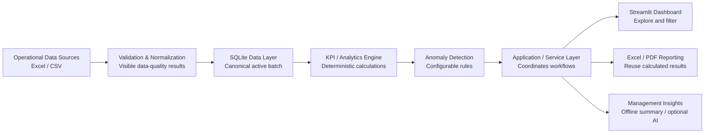

# 业务数据自动化与 KPI 仪表盘

## 制造运营案例研究

**最终作品集发布包 · v1.0.0**

> **作品集案例 / 合成数据演示。** 所有制造记录均为生成数据。本项目不代表客户部署、已验证 ROI 或生产级 MES。

- **在线演示：** [Streamlit 公开演示](https://manufacturing-operations-intelligence-3pvpwneerbbz2xbx5hgaqw.streamlit.app/)
- **代码仓库：** [GitHub](https://github.com/lan995173441/manufacturing-operations-intelligence)
- **发布基线：** [`v1.0.0` 标签](https://github.com/lan995173441/manufacturing-operations-intelligence/tree/v1.0.0)
- **英文主文档：** [PORTFOLIO_RELEASE_PACKAGE.md](PORTFOLIO_RELEASE_PACKAGE.md)

## 定位与案例说明

### 问题

运营团队常常在彼此独立的电子表格中管理生产计划、实际产出、质量和库存。手工汇总速度慢，无效记录容易被忽略，仪表盘与管理报告之间的数字也可能出现偏差。

### 解决方案

这个作品集项目将四个相关的 Excel/CSV 领域转化为可验证的分析工作流：可见的数据质量检查、规范化、SQLite 持久化、确定性 KPI 与异常计算、面向管理者的仪表盘、Excel/PDF 报告，以及无需 API Key 的确定性管理摘要。

### 所展示的业务价值

- 从运营文件到管理信息的可重复流程。
- 数据质量问题保持可见，而不是被静默丢弃。
- 仪表盘、异常规则、Excel 和 PDF 报告共享同一组计算结果。
- 使用 Python、电子表格、分析与报告自动化交付轻量级内部工具。

制造业场景让流程更具体；底层交付能力可迁移至其他运营、财务、供应链和业务报告工作流。

## 1. 截图采集包

在干净的浏览器会话中使用公开演示。每张截图使用 **1440 × 900 px**、浏览器缩放 **100%**，并裁掉浏览器外框。统一采用 16:10 裁剪，不保留工具提示、终端窗口或 Streamlit 所有者控制面板。界面保持英文。

| 编号 | 精确页面与筛选 | 应展示的合成场景与 KPI 数值 | 必须展示的图表/表格 | 标题与 Upwork 图注 |
| --- | --- | --- | --- | --- |
| **01** | **Overview**。日期：`2025-01-01`–`2025-03-31`；产线、班次、产品留空；停机阈值 `120`。 | 生产达成率 **98.01%**；良品率 **97.79%**；废品率 **2.21%**；总停机 **12,661 line-minutes**；库存风险 **0 materials**；Completed Orders 保持 **N/A**，并保留其证据限制。该阈值下受控数据会产生 **52** 条待复核异常。 | 六张 KPI 卡片、Alerts 区域、每日计划与实际产出趋势。 | **Executive Overview** — “Validated production, quality, inventory, and exception signals in one management view.” |
| **02** | **Production**。日期：`2025-01-26`–`2025-02-01`；产线 `LINE-02`；班次、产品留空；停机阈值 `120`。 | 受控低绩效：达成率 **73.52%**、总停机 **296 line-minutes**、LINE-02 产出 **11,909 ea**，以及 **28** 条生产/偏差异常。 | 计划与实际趋势、按产线产出、按产线停机、生产明细、相关异常。 | **Production Planning & Performance** — “Filters isolate a reproducible plan-versus-actual gap, downtime, and rule-based exceptions.” |
| **03** | **由两张同风格画面组合**：左侧 **Quality** — 日期 `2025-02-27`–`2025-03-03`、产线 `LINE-01`；右侧 **Inventory** — 截止日 `2025-03-18`、物料 `MAT-005`、`MAT-012`、`MAT-027`、`MAT-038`；其余筛选留空。分别以 1440 × 900 采集后，横向合成为 **2560 × 1440 px**。 | 质量面板：良品率 **88.39%**、废品率 **11.61%**、**10** 条高废品率异常。库存面板：**4 materials** 低于安全库存，均观测于 `2025-03-18`：MAT-005 **191/248 ea**、MAT-012 **277.320/332 l**、MAT-027 **297.114/512 m**、MAT-038 **386.010/644 kg**。 | 质量处置趋势与质量异常；库存物料表和库存观察图。 | **Quality Monitoring & Inventory Risk** — “Deterministic quality and stock-risk rules focus attention on the exceptions that need review.” |
| **04** | **Reports & Insights**。日期：`2025-01-01`–`2025-03-31`；产线、班次、产品留空；停机阈值 `120`。先选择 **Generate management summary**，再选择 **Generate management reports**。 | 范围说明、52 条异常，以及标有 **Deterministic offline summary · AI is disabled** 的状态。 | 报告范围趋势、异常表、包含限制说明的离线摘要，以及 **Download Excel report** / **Download PDF report** 操作。 | **Automated Reporting & Insights** — “One validated analytics payload drives dashboard insight, Excel, PDF, and a no-key management summary.” |

**采集规则：**截图 03 是有意设计的双画面组合，并非重复截图。它是在四个主资产中同时展示独立质量页和库存页的高效方式。

## 2. 演示数据展示

已纳入版本控制的 90 天样例是确定性的，无需改变产品逻辑即可支持四张截图：

| 受控场景 | 可复现展示窗口 | 可展示的证据 |
| --- | --- | --- |
| 生产低绩效 | LINE-02，`2025-01-26`–`2025-02-01` | 在植入时段内实际产出低于计划产出的 80%；截图汇总达成率为 73.52%。 |
| 停机峰值 | LINE-03，`2025-02-12`–`2025-02-14` | 每个峰值生产槽的停机时间至少为 150 line-minutes，可通过全范围异常或聚焦的生产演示展示。 |
| 废品率上升 | LINE-01，`2025-02-27`–`2025-03-03` | 场景中植入的最终废品率至少为 10%；截图显示为 11.61%。 |
| 库存风险 | MAT-005、MAT-012、MAT-027、MAT-038，`2025-03-12`–`2025-03-18` | 四种物料的快照低于源数据中的安全库存。 |
| 未完成订单 | 期末附近的四个合成订单 | 当前数据契约缺少权威完工证据，因此 Completed Orders 和 Schedule Adherence 保持不可用，不进行推断。 |

全范围概览刻意保持真实感，而不是完美的 100%：达成率 98.01%、良品率 97.79%、废品率 2.21%，且存在非零停机。聚焦场景能让异常可见，同时不误导全周期表现。

## 3. 架构图

**标题：**From Operational Files to Management Insight
**图注：**紧凑的分层工作流只验证一次运营数据，以确定性方式计算事实，并在仪表盘、报告和管理洞察之间复用结构化结果。
**建议导出：**GitHub 使用 SVG；Upwork 和视频使用 **1600 × 900 px** PNG。

报告和管理洞察从服务层分支，因为它们消费结构化计算结果；它们不重新计算 KPI，也不判定异常。

## 4. 45–60 秒演示视频分镜

| 时间 | 画面操作 | 英文旁白 | 屏幕字幕 |
| --- | --- | --- | --- |
| **0–5 秒** | 显示标题，然后打开公开演示。 | “Disconnected operations spreadsheets can make management reporting slow and inconsistent.” | Business Data Automation & KPI Dashboard |
| **5–15 秒** | 展示截图 01 状态，依次指向 KPI 卡片和趋势。 | “This workflow validates operational data and turns it into a clear executive view of production, quality, downtime, and inventory.” | Validated operational intelligence |
| **15–25 秒** | 应用截图 02 的筛选，指向计划与实际以及异常。 | “Managers can isolate a production line and date range, compare plan versus actual, and review the exceptions behind the result.” | Production performance by scope |
| **25–35 秒** | 依次展示截图 03 的质量和库存面板。 | “Deterministic rules expose elevated scrap and materials below safety stock, with the values, thresholds, and scope kept visible.” | Quality and inventory risk |
| **35–45 秒** | 打开截图 04 状态，展示生成报告与两个下载按钮。 | “Excel and PDF management reports reuse the same calculated results shown in the dashboard.” | Consistent automated reporting |
| **45–52 秒** | 生成管理摘要，展示离线标签和限制说明。 | “A factual offline summary works without an API key. Optional AI can only help phrase already calculated facts.” | AI optional · facts deterministic |
| **52–60 秒** | 展示架构图并返回标题。 | “It is a compact example of reliable Python, spreadsheet, dashboard, and reporting automation.” | Manufacturing Operations Case Study |

## 5. Upwork 作品集文案

### A. 作品集标题

**Business Data Automation & KPI Dashboard — Manufacturing Operations Case Study**

### B. 简短描述

构建了一套 Python 工作流，将生产、质量和库存电子表格转化为经过验证的 KPI、基于规则的异常、交互式仪表盘，以及自动化 Excel/PDF 管理报告。本作品集案例使用合成数据展示端到端业务数据自动化。

### C. 详细描述

运营团队常将计划、生产、质量和库存信息保存在分散的 Excel 与 CSV 文件中。在这些文件能够支持管理决策前，数据需要经过检查、对齐、一致计算和清晰呈现。

在本作品集案例中，我设计了一套轻量级内部工具：它验证四个相关运营数据集，按数据集、行、字段、原因和严重度报告错误，规范化通过验证的记录，并在 SQLite 中保存规范的活动批次。确定性的 Python 逻辑计算已记录的生产、质量、停机和库存 KPI。可配置规则识别异常，并保留观测值、阈值、严重度、实体和日期范围。

Streamlit 界面提供 Overview、Production、Quality、Inventory 和 Reports & Insights 区域，以及实用筛选条件。Excel 与 PDF 报告复用仪表盘使用的同一分析结果。确定性的离线管理摘要无需 API Key；可选 AI 只能总结结构化事实，不能计算 KPI 或判定异常。

这是一个合成数据作品集演示，不代表客户部署、商业 ROI 结果或生产级 MES。

### D. 项目角色

产品范围设计；数据契约与 KPI 文档；架构；Python 实现；数据验证；分析与异常逻辑；仪表盘 UX；Excel/PDF 报告；自动化测试；发布加固；以及技术文档。

### E. 交付物

- 包含五个运营区域和筛选条件的 Streamlit 仪表盘
- Excel/CSV 导入及可观察的验证结果
- 规范化与 SQLite 持久化
- 确定性 KPI 与可配置异常引擎
- Excel 和 PDF 管理报告
- 确定性离线管理摘要与可选的受约束 AI 支持
- 90 天合成演示数据集
- 测试、架构文档、数据契约、KPI 定义和发布证据

### F. 技能 / 标签

Python · Excel Automation · Data Processing · Data Validation · Pandas · Streamlit · Plotly · SQLite · KPI Dashboard · Business Intelligence · Data Visualization · Automated Reporting · PDF Reports · Manufacturing Analytics · pytest

### G. 技术栈

Python 3.12、Streamlit、Pandas、Plotly、SQLite、OpenPyXL、ReportLab、pytest、Ruff 和 Git。

### H. 业务问题

分散的运营电子表格会造成重复手工汇总、隐藏的数据质量问题、计算口径不一致，以及缓慢的管理报告。

### I. 解决方案

分层 Python 工作流验证并规范化相关数据文件、保存一致记录、计算已记录的 KPI 和确定性异常，并通过仪表盘及可重复的 Excel/PDF 报告交付结果。

### J. 合成数据免责声明

**作品集案例 / 合成数据演示。** 所有记录均为生成数据。不主张客户数据、客户部署、商业成果或已量化 ROI。

## 6. GitHub README 审阅与行动

当前 README 已包含清晰的客户导向标题、在线演示链接、业务问题、解决方案、架构、数据流、技术参考、快速启动、测试、AI 边界和限制。应保留这些内容。

完成素材采集后，建议：

1. 用四张优化后的 PNG/WebP 资产替换计划截图列表，并配简短图注。
2. 将截图 01 放在 **Demo** 下；将截图 02 和 04 加入三卡片图库，并链接到完整资产。
3. 在 **Architecture** 或 **Data flow** 下加入 SVG 架构图。
4. 仅保留可验证元数据：当前发布版本和 Python 3.12 有价值；公开 CI 建立前避免装饰性徽章。
5. 在技术安装细节前保留合成数据标签、在线演示链接和限制说明。

## 7. 作品集封面规格

**来源：**截图 01，Executive Overview。

- **画布：**1600 × 1000 px（或 Upwork 当前建议的封面比例）；以仪表盘截图为完整背景，并在左侧 38% 叠加轻微深海军蓝遮罩。
- **主标题：**第一行 `BUSINESS DATA AUTOMATION`；第二行 `& KPI DASHBOARD`。
- **副标题：**`Manufacturing Operations Case Study`。
- **可选流程行：**`Operational Data → Validation → KPI → Dashboard → Reports`。
- **布局：**文字左对齐于安静的遮罩区域；右侧保留 KPI 卡片和生产趋势。使用清晰无衬线字体、白色主文字、低饱和蓝色点缀；不添加虚构 Logo、客户名称、图标或统计数据。
- **质量检查：**使用准确的发布版截图；不展示浏览器外框、所有者控制、调试面板、工具提示或开发者界面。

## 8. 作品集资产质量检查

已审阅的公开演示、仓库、README 和计划采集状态均使用合成数据，且不需要付费 API Key。发布视觉资产前，逐一检查图片/视频帧：

- 不含本地或云端文件路径；
- 不含 API Key、令牌、密钥、私有数据或个人数据；
- 不含终端、测试运行器、Git、Streamlit 所有者面板、浏览器账户或开发工具；
- 不含未捕获异常、调试输出或编辑器外框；
- 仅显示公开演示 URL、公开仓库 URL 和生成的运营数据。

## 9. 最终资产清单

| 资产 | 状态 | 来源 | 所需操作 |
| --- | --- | --- | --- |
| 作品集封面 | **NEEDS HUMAN CAPTURE** | 截图 01 与封面规格 | 采集干净的 Overview 状态并制作封面。 |
| 截图 01 | **NEEDS HUMAN CAPTURE** | 公开演示，指定 Overview 范围 | 以 1440 × 900 采集。 |
| 截图 02 | **NEEDS HUMAN CAPTURE** | 公开演示，LINE-02 低绩效范围 | 以 1440 × 900 采集。 |
| 截图 03 | **NEEDS HUMAN CAPTURE** | 公开演示，Quality 与 Inventory 双画面 | 分别采集并合成为 2560 × 1440。 |
| 截图 04 | **NEEDS HUMAN CAPTURE** | 公开演示，Reports & Insights 范围 | 生成摘要和报告后采集。 |
| 架构图 | **READY** | 本文档中的 Mermaid 源码 | 生产视觉资产时导出 SVG/PNG。 |
| 45–60 秒视频 | **NEEDS HUMAN CAPTURE** | 上方分镜 | 使用四个截图状态录制并添加字幕。 |
| Upwork 标题 | **READY** | 第 5A 节 | 粘贴到 Upwork。 |
| Upwork 简短描述 | **READY** | 第 5B 节 | 粘贴到 Upwork。 |
| Upwork 详细描述 | **READY** | 第 5C 节 | 粘贴到 Upwork。 |
| 技能/标签 | **READY** | 第 5F 节 | 选择 Upwork 中可用的对应标签。 |
| GitHub README | **READY** | [README.zh-CN.md](../../README.zh-CN.md) | 素材准备后加入已采集的资产。 |
| 在线演示 | **READY** | Streamlit 公开演示 | 保持公开演示配置和仅合成数据。 |
| GitHub 仓库 | **READY** | 公开 GitHub 仓库 | 在 GitHub 设置中添加仓库描述和相关主题。 |
| v1.0.0 发布 | **READY** | 现有 `v1.0.0` 标签 | 如果 Release 页面尚不存在，再补充 GitHub Release Notes。 |

## 10. 剩余人工操作

1. 在干净、未登录的浏览器配置文件中按指定状态采集四个资产。
2. 合成截图 03 和作品集封面，并按质量检查表逐帧审阅。
3. 将 Mermaid 架构图导出为 SVG 和 PNG。
4. 按已批准的英文旁白和字幕录制 45–60 秒视频。
5. 将最终图片和视频链接加入 GitHub 与 Upwork，并在 GitHub 中设置仓库描述和相关主题。
