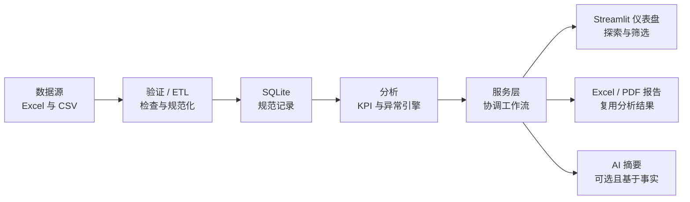

# 作品集发布包

**业务数据自动化与 KPI 仪表盘**

*制造运营案例研究*

> 作品集案例 / 合成数据演示。本项目使用生成的制造数据，不代表客户部署或经验证的商业成果。

英文主文档：[PORTFOLIO_RELEASE_PACKAGE.md](PORTFOLIO_RELEASE_PACKAGE.md)

## 最终定位

本项目展示如何把分散的运营电子表格转化为经过验证、可重复执行的管理工作流。制造业场景用于呈现可迁移的交付能力：多源数据导入、数据质量控制、确定性 KPI 计算、基于规则的异常检测、交互式仪表盘、自动报告，以及可选的 AI 辅助管理表达。

**主要受众：**Upwork 客户、中小企业、制造运营团队，以及需要数据、仪表盘、Excel、Python 和报告自动化的客户。

## 业务案例

### 问题

制造团队经常用彼此独立的电子表格管理生产计划、实际产出、质量和库存。格式差异、缺失值和无效值让汇总变得缓慢，手工重建指标也容易产生口径不一致。管理者需要在不逐行检查数据的情况下看到绩效与异常。

### 解决方案

应用接收 Excel 或 CSV 运营数据，验证各数据集，规范化通过验证的记录，并在本地保存一致的数据。确定性分析引擎计算已记录的 KPI 和规则异常。Streamlit 仪表盘展示结果，Excel 与 PDF 导出复用相同的计算结果。可选 AI 层可将结构化事实转写为管理语言；没有 API 密钥时仍提供确定性的离线摘要。

### 工作流

```text
电子表格文件
  -> 验证与可见的问题报告
  -> 规范化
  -> SQLite 持久化
  -> KPI 与异常引擎
  -> 应用服务
  -> 仪表盘、Excel/PDF 报告与可选 AI 摘要
```

### 关键能力

- 处理四个相互关联的运营领域：生产计划、生产实绩、质量和库存。
- 报告模式、类型、必填字段、重复、关系和数值错误，不静默丢弃无效行。
- 计算生产达成率、良品率、废品率、停机时间、完工订单、计划遵守率、库存风险和产线产出。
- 通过可配置规则识别生产、质量、停机、偏差和库存异常，并保留严重度与上下文。
- 提供 Overview、Production、Quality、Inventory、Reports & Insights 五个区域，并按适用场景提供日期、产线、班次、产品和物料筛选。
- 从仪表盘使用的同一组已验证分析结果生成结构化 Excel 和管理型 PDF 报告。
- 提供离线管理摘要，并支持受约束的可选 AI 草稿。

### 架构

设计将界面与业务规则分离。Streamlit 调用应用服务；服务协调存储库、分析、异常规则、报告和摘要。KPI 函数不依赖 Streamlit，报告不重新计算指标，AI 组件只接收结构化的已计算事实。

[阅读完整架构](../../ARCHITECTURE.zh-CN.md) · [阅读架构决策](../decisions/)

### 业务价值

- 用可重复工作流替代反复的电子表格汇总。
- 在管理报告生成前暴露无效数据和数据质量限制。
- 让运营管理者在一个视图中查看产出、质量、停机、订单进度和库存风险。
- 生成一致的管理报告，无需在仪表盘与报告逻辑之间复制数字。
- 展示一套可适配其他运营数据与报告流程的方法。

以上是项目所展示的能力，不是已量化的客户 ROI 声明。

### 技术

Python、Streamlit、Pandas、Plotly、SQLite、OpenPyXL、ReportLab、pytest 和 Ruff。

### 测试

v1.0.0 发布记录包含 140 项通过的自动化测试和通过的 Ruff 检查。覆盖重点包括数据验证、规范化、存储行为、精确 KPI 固定数据、异常边界、服务集成、报告、AI 回退行为和发布冒烟检查。参见[测试计划](../quality/TEST_PLAN.zh-CN.md)和[发布检查表](../release/RELEASE_CHECKLIST.zh-CN.md)。

### 限制

- 本地、单用户作品集 MVP；没有身份验证、多租户、托管环境或企业集成。
- 仅使用合成演示数据。
- 采用批量电子表格流程，不接入实时设备、MES、ERP、OPC-UA 或 IoT。
- KPI 语义遵循作品集中的已记录假设，在真实组织使用前需要确认。
- AI 文本是可选建议并需人工复核；确定性计算始终是权威来源。
- 不宣称客户部署、商业 ROI、生产规模性能或法规合规性。

## 截图采集计划

使用 1440 x 900 或相近的 16:10 桌面视口。加载随附合成数据，浏览器缩放保持 100%，并统一裁剪浏览器外框。不要包含 API 密钥、本地路径、终端窗口或调试输出。

| 编号 | 精确应用状态与筛选 | 应显示内容 | 截图标题 | 推荐 Upwork 图注 |
| --- | --- | --- | --- | --- |
| 01 管理概览 | 加载演示数据，打开 **Overview**。日期：**2025-01-01 至 2025-03-31**。产线、班次、产品留空（全部）。停机阈值：**120 分钟**。 | 六个核心 KPI 卡片、异常提示、生产趋势和管理范围说明。 | Executive Operations Overview | 一个管理视图汇总四个已验证数据集中的生产、质量、停机、完工订单和库存风险。 |
| 02 生产分析 | 打开 **Production**。日期：**2025-01-26 至 2025-02-01**。产线：**LINE-02**。班次和产品留空。 | 计划与实际趋势、生产达成率、总停机时间、产线产出、产线停机，以及受控低绩效窗口的相关异常。 | Production Plan vs Actual | 日期和产线筛选可定位可复现的低绩效时段，并展示计划产出与实际产出的差异。 |
| 03 质量分析 | 打开 **Quality**。日期：**2025-02-27 至 2025-03-03**。产线：**LINE-01**。班次和产品留空。 | 良品率、废品率、质量趋势，以及为废品率上升场景生成的质量异常。 | Quality Yield and Scrap Trend | 确定性质量指标和异常规则能突出受控的废品率上升，无需 AI 参与计算。 |
| 04 库存/风险 | 打开 **Inventory**。日期：**2025-03-12 至 2025-03-18**。生产筛选留空。选择物料 **MAT-005、MAT-012、MAT-027、MAT-038**。 | 低于安全库存的物料 KPI、最新库存与安全库存对比，以及库存观察图。异常明细表在截图 05 中采集。 | Inventory Risk by Material | 最新快照库存逻辑识别低于安全库存的物料，并向管理者提供集中的异常清单。 |
| 05 报告/洞察 | 打开 **Reports & Insights**。日期：**2025-01-01 至 2025-03-31**。产线、班次、产品留空。阈值：**120 分钟**。先生成管理摘要，再生成报告。 | 范围摘要、生产趋势、异常表、确定性离线摘要，以及 Excel 和 PDF 下载操作。 | Automated Reports and Management Insights | 相同的已验证分析结果同时驱动仪表盘洞察、Excel、PDF 管理报告和离线摘要。 |
| 06 架构图（可选） | 将本文档中的架构图以白色或透明背景导出为 1600 x 900。 | 一条清晰的左到右流程，标签简短，不展示代码级细节。 | From Spreadsheet to Management Insight | 分层 Python 工作流验证运营文件、计算确定性指标，并发布一致的仪表盘和报告结果。 |

发布前，应确认画面中的每个数值都能由发布版数据复现，且不存在遮挡标签的工具提示。

## 45–60 秒演示视频脚本

| 时间 | 画面操作 | 精确旁白 | 屏幕字幕 |
| --- | --- | --- | --- |
| 0–5 秒 | 显示标题页，然后切换到已加载的应用。 | “分散的运营电子表格会让管理报告变得缓慢且不一致。” | Business Data Automation & KPI Dashboard |
| 5–15 秒 | 打开 Overview，依次展示核心 KPI 和生产趋势。 | “这个作品集案例验证生产、质量和库存数据，再将其转化为清晰的管理概览。” | Validated operational intelligence |
| 15–25 秒 | 打开 Production，应用 LINE-02 和低绩效时间窗口筛选。 | “管理者可以比较计划与实际产出，定位产线或日期范围，并检查停机和订单进度。” | Production performance by scope |
| 25–35 秒 | 打开 Quality，然后打开 Inventory，展示质量和库存风险场景。 | “确定性规则会突出废品、生产、停机和低于安全库存的物料，同时保留阈值和上下文。” | Reproducible anomaly detection |
| 35–45 秒 | 打开 Reports & Insights，生成 Excel 和 PDF 报告。 | “应用从相同的计算结果创建结构化 Excel 与 PDF 管理报告，不重复计算 KPI。” | Consistent automated reporting |
| 45–55 秒 | 在禁用 AI 的模式下生成管理摘要，并展示限制说明。 | “没有 API 密钥也能生成事实型离线摘要；可选 AI 只帮助表达和排序已经计算的事实。” | AI optional · deterministic facts authoritative |
| 55–60 秒 | 显示架构图和结束标题。 | “这是可靠的 Python、电子表格、仪表盘和报告自动化的紧凑示例。” | Portfolio Case Study · Synthetic Data |

## Upwork 作品集文案

### A. 作品集标题

**Business Data Automation & KPI Dashboard — Manufacturing Operations Case Study**

### B. 简短描述

我构建了一套 Python 应用，将生产、质量和库存电子表格转化为经过验证的 KPI、规则异常、交互式仪表盘，以及自动生成的 Excel/PDF 管理报告。项目使用合成数据，展示完整的业务数据自动化流程。

### C. 详细描述

许多运营团队将关键信息保存在独立的 Excel 和 CSV 文件中。这些数据在支持决策前，需要先检查、对齐、一致计算并清晰呈现。

在这个作品集案例中，我为四个相关的制造数据集设计并构建了完整的本地工作流：生产计划、生产实绩、质量和库存。应用验证数据模式与行值，可见地报告错误，规范化通过验证的记录，并将规范数据持久化到 SQLite。

确定性分析层计算已记录的生产、质量、停机、订单和库存 KPI。可配置规则识别运营异常，并说明观测值、阈值、严重度、实体和时间范围。Streamlit 仪表盘提供 Overview、Production、Quality、Inventory、Reports & Insights 五个区域和实用筛选条件。

Excel 与 PDF 管理报告使用和仪表盘相同的分析结果。应用还提供确定性离线管理摘要。可选 AI 可以帮助总结和排序结构化事实，但不会计算权威 KPI，也不会决定异常是否存在。

这是使用合成数据构建的作品集演示，展示我如何处理电子表格自动化、数据质量、业务规则、仪表盘、报告、自动化测试和清晰交付文档。它不代表客户部署或生产 MES。

### D. 技能/标签

Python、Excel Automation、Data Processing、Data Validation、Pandas、Streamlit、Plotly、SQLite、KPI Dashboard、Business Intelligence、Data Visualization、Automated Reporting、PDF Reports、Manufacturing Analytics、pytest

### E. 问题陈述

分散在不同电子表格中的运营数据会造成重复手工工作、计算口径不一致、数据质量问题被隐藏，以及管理报告生成缓慢。

### F. 解决方案陈述

分层 Python 工作流验证和规范化相关文件、保存一致记录、计算已记录的 KPI 与异常，并通过交互式仪表盘和可重复的 Excel/PDF 报告发布结果。

### G. 交付物

- 包含五个运营区域和筛选条件的 Streamlit 仪表盘
- Excel/CSV 导入与可观察的验证报告
- 规范化与 SQLite 持久化
- 确定性 KPI 和可配置异常引擎
- Excel 与 PDF 管理报告生成
- 离线管理摘要和可选的受约束 AI 支持
- 90 天合成演示数据集
- 自动化测试、架构说明、数据契约、KPI 定义和发布文档

### H. 技术栈

Python、Streamlit、Pandas、Plotly、SQLite、OpenPyXL、ReportLab、pytest、Ruff 和 Git。

### I. 角色/职责

产品范围、数据契约设计、架构、Python 实现、验证与分析逻辑、仪表盘设计、报告、测试自动化、发布加固、技术文档和作品集展示。

### J. 数据免责声明

**作品集案例 / 合成数据演示。** 所有运营记录均为演示生成，不代表客户数据、客户部署、商业成果或已量化 ROI。

## GitHub 展示建议

### 仓库元数据

- **建议仓库名：**`business-data-automation-kpi-dashboard`
- **建议描述：**“Portfolio case study: validate operational spreadsheets, calculate deterministic KPIs and anomalies, and generate Streamlit dashboards plus Excel/PDF management reports.”
- **建议主题：**`python`、`streamlit`、`pandas`、`plotly`、`sqlite`、`excel-automation`、`data-validation`、`kpi-dashboard`、`business-intelligence`、`automated-reporting`、`manufacturing-analytics`、`portfolio-project`

### 仓库首页

- 在详细安装步骤前保留面向客户的标题、一句话价值主张、合成数据标签和截图带。
- 在 Demo 部分后立即放置三张图片：管理概览、生产分析、报告与洞察；其余截图通过紧凑图库链接。
- 直接链接 [ARCHITECTURE.zh-CN.md](../../ARCHITECTURE.zh-CN.md)、[KPI_DEFINITIONS.zh-CN.md](../data/KPI_DEFINITIONS.zh-CN.md)和本案例。
- 仅在稳定且经过脱敏的部署存在后添加在线演示链接。在此之前，将演示标记为本地，并提供一键启动方式。
- 只使用可验证徽章。发布版本和支持的 Python 版本有价值；公开 CI 存在后再添加测试/CI 徽章。避免装饰性技术数量或“built with love”徽章。
- 仓库公开后，根据现有 `v1.0.0` 标签创建 GitHub Release。附加发布说明，不附加本地数据库或生成报告。

## 架构图规格

**目的：**让非技术客户在十秒内理解交付流程。

**格式：**1600 x 900，白色或透明背景，横向流程，一种强调色，深色清晰标签，简洁线性图标，主流程不放框架 Logo。使用带简短副标题的等尺寸节点。提供 README 使用的 SVG 和 Upwork/视频使用的 PNG。



作品集标题可以将最终输出简写为“仪表盘 → 报告 → AI 摘要”，但正式图应从服务层分支。这与实现一致：报告和 AI 都消费结构化结果，彼此没有依赖关系。

## 作品集资产清单

| 资产 | 状态 | 证据/下一步 |
| --- | --- | --- |
| GitHub 仓库 | **MISSING** | 本地已有专业 Git 历史和 `v1.0.0` 标签，但未配置远程仓库。创建公开仓库、检查可见性后推送分支与标签。 |
| 在线演示 | **MISSING** | 本地应用可复现；尚无已记录的托管地址。选择托管方案并确认合成数据、资源限制和禁用 AI 行为后再发布。 |
| 3–5 张截图 | **MISSING** | 上文已定义精确状态与图注。采集五张发布版图片，优化后存入 `docs/portfolio/assets/screenshots/`。 |
| 架构图 | **NEEDS WORK** | 架构图规格和 Mermaid 源码已就绪；还需导出正式 SVG 与 PNG。 |
| 45–60 秒演示视频 | **MISSING** | 60 秒脚本已就绪；完成截图与最终视口检查后录制。 |
| Upwork 作品集描述 | **READY** | 上文已提供文案，并明确标注合成数据。 |
| README | **READY** | 本展示分支包含面向客户的英文和中文版本。 |
| 样例数据集 | **READY** | 四个纳入版本控制的合成 CSV 数据集覆盖 90 天和受控异常场景。 |
| v1.0.0 发布 | **READY** | 本地已有带注释的发布标签和发布文档；创建远程仓库后发布 GitHub Release。 |

## 发布顺序

1. 使用已发布标签的行为采集并检查五张截图。
2. 将架构图导出为 SVG 与 PNG。
3. 录制并添加 60 秒视频字幕。
4. 创建 GitHub 仓库并推送已审核的历史和标签。
5. 添加截图与演示媒体，然后发布 GitHub Release。
6. 如有需要，发布经过脱敏的在线演示。
7. 使用上述文案、最终链接和媒体发布 Upwork 作品集。
